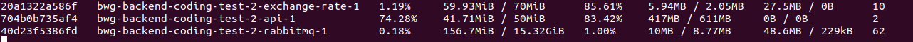
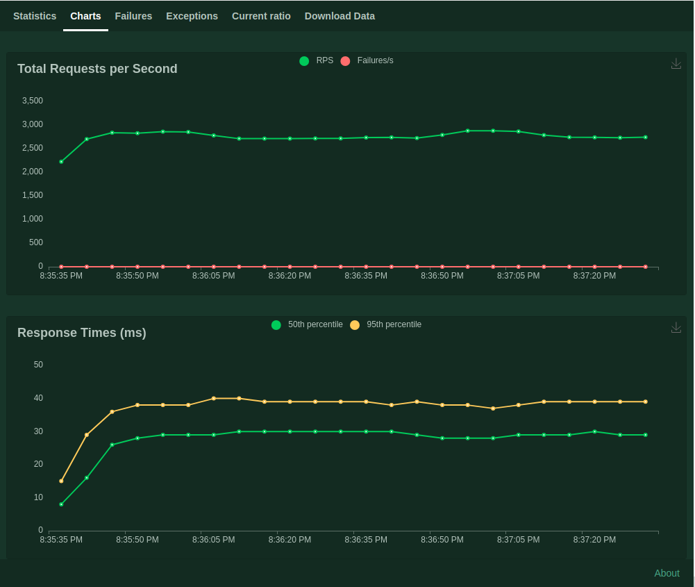

# Load testing

## Locust

#### System

- Ubuntu 20.04.6 LTS
- 12th Gen Intel® Core™ i7-12700H × 20
- Memory 15,3 GiB

### Report

> _Raw report at [docs/files/locust-report.csv](files/locust-report.csv)_

Params: 100 users, 10 users / second spawning, 2 minute

#### Results

- **~2.7k RPS**

- **8ms** _50th percent_ responses for _40 users_
- **15ms** _95th percent_ responses for _40 users_

- **29ms** _50th percent_ responses for _100 users_
- **39ms** _95th percent_ responses for _100 users_

### Docker stats

### Locust Chars

